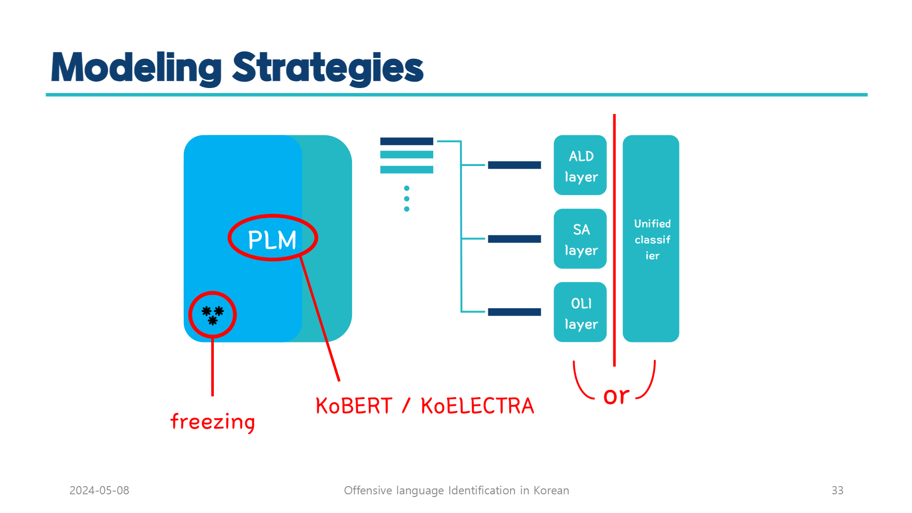

# 📝 **Offensive Language Identification in Korean**

## ✅ **프로젝트 개요**
- **프로젝트명:** Offensive Language Identification in Korean  
- **목적:**  
   - 욕설 포함 여부뿐만 아니라, 욕설이 없어도 공격적 의도를 내포한 문장 식별  
   - 다양한 사회·문화적 맥락을 고려한 부적절한 표현 감지
   - **욕설이 있지만 공격적 의도가 아닌 문장, 욕설이 없지만 긍정적인 문장 등을 구분**  
- **예시:**  
   - "기다려라 찾아간다 ㅋㅋ 평생 누워있게 해줄게" → 직접 욕설 없음, 그러나 공격적 의도 포함  

## ✅ **모델링 전략**

---

## ✅ **관련 연구 동향**
### **1. KOAS (Korean Text Offensiveness Analysis System)**  
- **주요 작업:**  
   - **욕설 감지 (Abusive Language Detection)**: 욕설 포함 여부 판단  
   - **감정 분석 (Sentiment Analysis)**: 긍정, 중립, 부정 분류  
- **모델 구조:**  
   - Shared Convolution Layer (공통 레이어)  
   - Task-specific Layers (작업별 특화 레이어)  
- **평가 데이터:**  
   - 유튜브, 네이버 영화 리뷰, DC인사이드  
   - 약 4만 5천 개 문장 학습  

### **2. KODOLI (Korean Dataset for Offensive Language Identification)**  
- **데이터셋 구성:**  
   - 총 38,525개 댓글  
   - 주요 소스: DC인사이드, 네이버 뉴스 댓글, 기타 쇼핑 및 게임 플랫폼  
- **주요 작업:**  
   - Offensive Language Detection (OFFEN, LIKELY, NOT)  
   - Abusive Language Detection (ABS, NON)  
   - Sentiment Analysis (POS, NEU, NEG)  
- **사용 모델:**  
   - BiLSTM, CNN, KoBERT, KoELECTRA  

---

## ✅ **모델 선정 및 설명**
### **선정 모델:**  
- **KoBERT:** 한국어 특화된 BERT 모델  
- **KoELECTRA:** 한국어 특화된 ELECTRA 모델  

### **모델 특징:**  
- **KoBERT:** Transformer 기반 양방향 문맥 이해  
- **KoELECTRA:** Replaced Token Detection 기법 활용  

### **토크나이저 비교:**  
- **Mecab_ko:** 형태소 분석 최적화  
- **SentencePiece:** 일반적인 토크나이저  

---

## ✅ **실험 및 결과**
### **Multi-task Learning (MTL) 적용:**  
- **Shared Layers:** 모든 작업에 공통 적용  
- **Task-specific Layers:** 작업별 특화 레이어  

## 1️⃣2️⃣3️⃣4️⃣5️⃣6️⃣**Classifier modeling**

### KoBERT – Classifier Modeling

| Metric | ALD | SA | OLI |
| --- | --- | --- | --- |
| Unified Classifier | **91.47%** | 75.91% | **81.38%** |
| Specific Classifier for each Task | 90.62% | **79.68%** | 78.12% |

### KoELECTRA – Classifier Modeling

| Metric | ALD | SA | OLI |
| --- | --- | --- | --- |
| Unified Classifier | **88.86%** | **74.24%** | **80.49%** |
| Specific Classifier for each Task | 65.##% | 70.##% | 78.##% |

---

## ✅ **참고 문헌**
- KOAS: Korean Text Offensiveness Analysis System  
- KODOLI: Korean Dataset for Offensive Language Identification  

---
